The shearlet transform from applied harmonic analysis is currently the
state of the art when analyzing multidimensional signals with
anisotropic singularities. Its optimal sparse approximation properties
and its faithful digitalization allow shearlets to be applied to
different problems from imaging science, such as image denoising, image
inpainting, and singularities detection. The shearlet transform has also
be successfully utilized, for instance, as a feature extractor. As such
it has been shown to be well suited for image preprocessing in
combination with data-driven methods such as deep neural networks. This
requires in particular an implementation of the shearlet transform in
the current deep learning frameworks, such as TensorFlow. With this
motivation we developed a tensor shearlet transform aiming to provide a
faithful TensorFlow implementation. In addition to its usability in
predictive models, we also observed an significant improvement in the
performance of the transform, with a running time of almost 40 times the
previous state-of-the-art implementation. In this paper, we will also
present several numerical experiments such as image denoising and
inpainting, where the TensorFlow version can be shown to outperform
previous libraries as well as the learned primal-dual reconstruction
method for low dose computed tomography in running time.

**Keywords:** Software package, deep learning, shearlets, imaging
science.

**Mathematics Subject Classification:** 68G05, 68U10, 97N80, 68Q32.

Introduction
============

Feature extraction plays an important role in modern image processing
and is used as a crucial step in various problem settings of industrial
and scientific applications. One example of particular relevance is
classification. In fact, currently available approaches typically
involve the extraction of features such as edges and blobs, which eases
the task of the image classifier @andrade2019wfset
[@yu2018simultaneous; @dalal2005histogram]. The type of features which
needs to be extracted certainly depends strongly on the problem one aims
to tackle. Blob and line detection, for instance, involve fundamentally
different structures @rafael2019symfd [@hough1962trans]. Images are
often modelled as consisting of features which are delimited by oriented
singularities. Hence these singularities contain an important amount of
semantic information in images @torre1986edge [@brady1982computational].
Even more, the human visual system is also known to react most strongly
to those curvilinear structures. For this reason, singularity detection
can be considered a key feature extraction task in image processing.

Being able to describe the singularities of an image provides crucial
means for efficiently approximating it, usually in terms of what is
referred to as sparse approximation. This task is typically performed by
representation systems, which incorporate the specific properties of the
images in terms of transformations applied to a set of generating
functions. In applied harmonic analysis, as a transformation leading to
different resolutions the action of scaling is customarily applied
@meyer1992wavelets, leading to *multiscale systems*. Changing the scale
of the generating function enables the system to study features of
different sizes, allowing to detect persistent properties along scales
such as edges, or more generally, singularities. The situation of images
as opposed to signals – i.e., 2D as opposed to 1D data – requires more
attention, since not only the position but also the orientation needs to
be encoded by the representation system. Thus the incorporation of a
transformation that changes the orientation becomes necessary, leading
to *multiscale directional systems*. The system of shearlets introduced
in 2006 @gitta2005shearlets is presumably to date the most widely used
system of this type.

The main goal of this paper is to present a digital framework leading to
an efficient and faithful implementation of the shearlet transform,
which can be utilized directly in the machine learning framework
TensorFlow. This allows deployment in various hardware architectures
(e.g. GPUs or TPUs), thereby exploiting the inner structure of the
operations involved. This is in fact relevant in the current customized
machine learning hardware development.

Multiscale Directional Systems and Shearlets
--------------------------------------------

The purpose of applied harmonic analysis is to develop multiscale
systems for efficient representations as well as the analysis of
regularity and detection of features such as singularities. The first
celebrated multiscale system were wavelets @mallat1992singularities,
which can be shown to be optimal for singularity extraction in 1D
functions.

As discussed, the 2D case bears additional difficulties in terms of
singularities of different <span>*orientation*</span>. Wavelets are
deficient in describing such data due to their isotropic nature. This
was formally proven in 2004 by Candès and Donoho @candes2004curvelets.
At the same time, they introduced a new multiscale system called
<span>*curvelets*</span> by using parabolic scaling and rotation to
efficiently represent curvilinear singularities. The system of curvelets
can be regarded as a breakthrough in optimal representation of such
singularities. In fact, within the model situation of cartoon-like
functions the ability of curvelets to provide optimally sparse
approximation could be proven (cf. @candes2004curvelets), also
constituting the starting point of what is by now referred to as
<span>*geometric multiscale analysis*</span>. However, for practical
applications, curvelets can not be faithfully digitalized in the sense
of an implementation consistent with the continuum domain theory due to
the rotation operator, which is a major drawback (see
@candes2006discrete).

To address the problem of a faithful digitalization, several novel
multiscale directional systems were introduced such as *contourlets*
proposed by Do and Vetterli in 2005 @do2005contour. One can think of
this system as a filterbank approach to the curvelet transform. The main
advantage of contourlets is their availability to provide a faithful
digitalization. However, it still suffers from deficiencies in the
continuum setting. In fact, both curvelets and contourlets do not
provide a unified treatment of the continuum and digital situation,
and/or a theory for compactly supported systems to guarantee high
spatial localization. This also results in major difficulties to derive
straight forward approximation bounds in practical applications.

Finally, as an attempt to overcome all those limitations, the *shearlet
system* was introduced by one of the authors jointly with Labate and Guo
in 2006 @gitta2005shearlets. This system is generated by few functions,
and uses parabolic scaling together with a shear operator to change the
orientation of its elements. Unlike the rotation operator, the shear
operator maintains consistency properties with the digital lattice. This
now allows to treat the continuum and digital realm uniformly, resulting
in a faithful implementation, where most of the theoretical properties
are maintained. Also a variant of compactly supported shearlet systems
is available, which was shown to constitute a frame with bounds whithin
a numerically stable range @kittipoom2012compact as well as provide
optimal sparse approximation of cartoon-like functions
@kutyniok2011compact. The shearlet transform as a feature extractor was
also theoretically analyzed in terms of resolution of the wavefront set
@grohs2011continuous [@kutyniok2009resolution]. The wavefront set of a
distribution is a notion from microlocal analysis and contains the
position of the singularities of the distribution and their respective
orientation.

Several implementations of shearlets are available. Maybe the most
favorable one for applications due to its speed and accuracy is the
implementation of the compactly supported shearlets with a flexible
shearing operator @kutyniok2016shearlab. The current code is available
on .

Feature Maps and Convolutional Neural Networks {#SecFeat}
----------------------------------------------

Deep neural networks have played a major role in the last few years in
both research and industry, with its significance predicted to even
increase in the future. A <span>*neural network*</span> is a non-linear
model made of sequential applications of an affine transformation
encoded by weights together with a non-linearity. The weights of the
network are fitted or learned by minimizing a loss function over a
training data set. The affine transformation allows to map the input to
a convenient representation and the non-linearity is crucial to encode
complex patterns in the data set. Finally, the term <span>*deep*</span>
refers to a large number of layers corresponding to the number of
sequential applications.

The first network architecture that showed state-of-the-art results in
an image processing task was the so called *LeNet* proposed by Yann
LeCun in 1989 @lecun1989lenet. This network was able to classify small
images of handwritten digits with high accuracy. Since the invention of
convolutional neural networks, neural networks have started a triumphal
march with their primary application area still being imaging science.
Nowadays, convolutional neural networks present state-of-the-art
performance in, for instance, image classification
@krizhevsky2012imagenet and reconstruction @adler2018learned.

A <span>*convolutional neural network*</span> contains four types of
layers:

-   **Convolutional layer:** A convolution operator is applied, which
    results in the input being averaged locally by a filter defined in a
    small window moving through the entire input. The extension of the
    window is known as the receptive field of the convolutional layer.

-   **Pooling layer:** After the convolutional layer, one performs a
    dimensional reduction step, also known as pooling. This operation
    combines outputs of neuron clusters at one layer into a single
    neuron in the next layer by, for example, taking the average or the
    maximum.

-   **Activation layer:** Similar to all other network architectures,
    one then applies a non-linear univariate function componentwise to
    the output of the pooling layer. This is key to allowing the
    learning of complex non-linear patterns in the data. It is known
    that this layer provides the network translation invariance.

-   **Fully connected layer:** In certain situations such as
    classification, it is also convenient to use fully-connected layers
    as the last layers.

Convolutional networks were originally inspired by the animal visual
cortex, where individual cortical neurons respond to stimuli only in a
restricted region of the visual field @fukushima1980cortex
[@hubel1968receptive], called the receptive field. Besides its
biological resemblance, it also reduces the number of weights to learn
in comparison with networks with fully connected layers. For this
reason, these networks are much faster to train. Moreover, the structure
of its layers results in shift or space invariance as well as stability
under certain (Lipschitz) input deformations @wiatowski2015conv. This
characteristics matches the desiderata of several image processing tasks
such as image classification, when the object label is independent to
its position.

Due to the convolutional structure, the outputs of each layer can be
regarded as those features detected by the particular filters and the
extension of the receptive field, e.g., a vertical line or a curve.
Which features the network deems to be important is defined during
learning, depending on a particular task. Thus each layer constitutes a
feature map. In this sense a convolutional neural network can be
regarded as a sequential and hierarchical application of feature
extractors. Those feature maps will presumably represent different types
of features varying on size, direction, and amplitude depending on the
task at hand.

Given training data, a convolutional neural network learns those filters
(or feature maps) which in a certain sense best matches the function
class represented by this data. Thus such an approach is fully
data-driven, i.e., it learns end-to-end a suitable representation of the
data for a specific the task.

During the last years, hybrid methods @bubba2018learning
[@adler2018learned] became popular, since they encode the physics of the
problem, reduce the complexity of the learning problem, and allow a
better interpretation of the entire pipeline. <span>*Hybrid
methods*</span> incorporate a-priori information from the task to
perform, for example, the underlying data distribution and the function
class representing the data, to ease the learning task and at the same
time ensure solutions which fit with the desired model.

Since shearlets are known to optimally represent images governed by
curvilinear singularities as key features, they can be used as a
preprocessing step for a convolutional neural networks in imaging
science, thereby also reducing the computational complexity of the
respective problem by performing some type of heavy lifting. This type
of approach has already been used for edge and orientation detection
@ben2013wavelets [@andrade2019wfset], showing a significant advantage
over other methods that solve the problem using a pure data-driven
approach. In a similar manner, the shearlet transform can be applied to
other inverse problems involving deep neural networks, such as computed
tomography reconstruction @bubba2018learning. However, a digital version
of the shearlet transform for a widely used machine learning framework
such as TensorFlow is clearly in demand.

TensorFlow Scalability and Heterogeneity
----------------------------------------

Since its release in 2015, Tensorflow has become the most widely used
machine learning framework. Indeed, the community of users and
contributors is growing everyday. In coarse terms, TensorFlow is an
interface for expressing machine learning algorithms
@dean2015tensorflow. The main advantage over former frameworks such as
torch, scikit-learn, caffe, or theano consists in the fact that a
computation expressed using TensorFlow can be executed with almost no
modification on a wide variety of heterogeous systems, from mobile
devices to large-scale distributed systems with a lot of computational
devices, such as GPU cards. This system was created by Google Brain as
an open-source version of their local framework DistBelief. Google’s
need on scalability and heterogeneity gave the main inspiration for the
framework’s design with their main goal being to explore the power of
very-large-scale deep neural networks for predictive tasks.

TensorFlow expresses computations associated with a specific algorithm
as a dataflow-model, also known as computational graph, and maps them
onto the specific hardware architecture. The heterogeneity of the
framework, i.e., the possibility to use it in various hardware
architectures results from the linear algebra operations compiler XLA
(Accelerated Linear Algebra). XLA compiles the computational graph
composed by several tensor operations into the specific architecture,
making the training and evaluation of the model easily deployed in GPUs
and other accelerating chips such as TPUs. Operations such as
convolution and fast Fourier transform (fft) are particularly well
optimized in TensorFlow and have performance greater than their
equivalent in other programming languages.

These facts will also be beneficial for our intended Tensorflow version
of the shearlet transform. In fact, to compute shearlet coefficients of
an image, convolutions of the shearlet filters with the image need to be
preformed making it amenable to the use of the fft-based convolution.
Thus, the shearlet transform is indeed very well suited for TensorFlow.
In addition, TensorFlow provides full broadcasting capabilities which
permit the parallelization of the distinct shearlet coefficients
computation. We will show that in exchange it will gain the
computational power of this framework.

Contributions
-------------

The main contribution of this work is two-fold: We will first derive a
representation of the digital shearlet transform as a set of tensor
operations, leading ultimately to a faithful implementation in
TensorFlow. Second, we will demonstrate the power of implementing signal
convolutional transforms using the underlying linear algebra compiler of
TensorFlow, and its application to deep learning based solutions.

The main advantages of are related to the significant improvement in
running time in comparison with the other implementations of shearlets,
in particular, ([www.shearlab.org/software](www.shearlab.org/software)),
with a boost of around 30x in a GPU. Moreover, the heterogeneity of
TensorFlow gives this implementation the potential of being deployed in
the state-of-the-art accelerating chips, such as TPU, as well as in
large-scale clusters. In addition to the performance advantages, as
mentioned before, having an implementation of the shearlet transform in
TensorFlow, will allow the users to take advantage of the convenient
image representation given by the shearlet coefficients to improve their
own predictive models.

Outline
-------

This paper is organized as follows. Section [sec:DST] will introduce the
main concepts behind the shearlet transform, with its discrete version
leading to the *digital shearlet transform*. We will also discuss the
associated implementation in the case of compactly supported shearlets.
Section [sec:DSTasTO] is devoted to introducing the basic concepts in
TensorFlow, namely tensors and their constructors such as the matrix
multiplication operator and the Fourier operators and . We will then
make use of those concepts to write the digital sheralet transform as a
tensor operator which requires, in particular, an optimized
implementation of the Fourier shift operators and using TensorFlow
native operations. Section [sec:numerics] contains numerical results and
benchmarks of , in particular, the shearlet decomposition and
reconstruction, as well as shearlet based denoising and inpainting.
Finally, conclusions and future developements are presented in Section
[sec:conclusion].

Digital Shearlet Transform {#sec:DST}
==========================

The goal of this section is to introduce the 2D digital shearlet
transform, which operates on 2D arrays such as digital images. We would
like to point out that the theory and construction can be extended to
the 3D setting to handle videos and general 3D structures. However, this
is beyond the scope of this paper, and we refer the interested reader to
@kutyniok2016shearlab. As it is customary in signal and image
processing, the construction is often first stated in the continuous
case with continuous parameters @gitta2005shearlets.

In the sequel we will however immediately focus on the transform which
results from discretizing the parameter space while maintaining the
continuity in the domain. This yields the discrete shearlet transform
generated by the discrete shearlet system, which we now first define.

[@kutyniok2016shearlab] [sec2def1] Let
$\varphi, \psi, \tilde{\psi} \in L^2(\mathbb{R}^2)$ and
$c=(c_1,c_2)\in (\mathbb{R}_{+})^2$. Then the *shearlet system*
$SH(\varphi, \psi, \tilde{\psi}; c)$ is defined by
$$SH(\varphi, \psi, \tilde{\psi}; c) = \Phi(\varphi; c_1)\cup \Psi(\psi; c) \cup \tilde{\Psi}(\tilde{\psi}; c),$$
where $$\begin{aligned}
\Phi(\varphi; c_1) &= \{ \varphi_m = \varphi(\cdot - c_1 m): m\in \mathbb{Z}^2\},\\
\Psi(\psi; c) &= \{\psi_{j,k,m} = 2^{\frac{3}{4}j}\psi(S_k A_{2^j}\cdot - M_c m): j\geq 0, |k|\leq \lceil 2^{j/2}\rceil, m\in \mathbb{Z}^2 \}, \\
\tilde{\Psi}(\tilde{\psi}; c) &= \{\tilde{\psi}_{j,k,m} = 2^{\frac{3}{4}j}\tilde{\psi}(S_k^{\top}\tilde{A}_{2^j}\cdot - \tilde{M}_cm): j\geq 0, |k|\leq \lceil 2^{j/2}\rceil, m\in \mathbb{Z}^2\},
\end{aligned}$$ with the parabolic scaling matrices $A_{2^j}$ and
$\tilde{A}_{2^j}$ defined by
$$A_{2^j} = \left(\begin{matrix} 2^j & 0 \\ 0 & 2^{j/2} \end{matrix} \right) \quad \text{and} \quad \tilde{A}_{2^j} = \left( \begin{matrix} 2^{j/2} & 0 \\ 0 & 2^j \end{matrix} \right),$$
the shearing matrix $S_k$ is given by
$$S_k = \left(\begin{matrix} 1 & k \\ 0 & 1 \end{matrix}\right),$$ and
the translation matrices $M_c$ and $\tilde{M}_c$ are defined as
$$M_c \left( \begin{matrix} c_1 & 0 \\ 0 & c_2 \end{matrix} \right) \quad \text{and} \quad \tilde{M}_c = \left(\begin{matrix} c_2 & 0 \\ 0 & c_1 \end{matrix} \right),$$
respectively.

The purpose of the parabolic scaling matrices is to change the size of
the specific shearlet anisotropically, thereby aiming to model
anisotropic features at different scales, where the shearing matrix
changes the orientation to capture features at different directions.

Using the notion of discrete shearlet system as stated, we can now
define the discrete shearlet transform.

[@kutyniok2016shearlab] Let
$\Lambda = \mathbb{N}_0\times \{ -\lceil 2^{j/2}\rceil,\ldots,\lceil 2^{j/2}\rceil\}\times\mathbb{Z}^2$
be the parameter set. Further, let $SH(\varphi, \psi, \tilde{\psi}; c)$
be a discrete shearlet system and retain the notions from
Definiton [sec2def1]. Then the associated *shearlet transform* of
$f\in L^2(\mathbb{R}^2)$ is the mapping defined by
$$f\longrightarrow SH(\varphi,\psi,\tilde{\psi}) f(m',(j,k,m),(\tilde{j},\tilde{k},\tilde{m}))=(\langle f, \varphi_{m'}\rangle, \langle f, \psi_{j,k,m}\rangle, \langle f, \tilde{\psi}_{\tilde{j},\tilde{k},\tilde{m}}\rangle ),$$
where
$((m',(j,k,m),(\tilde{j},\tilde{k},\tilde{m}))\in \mathbb{Z}^2\times\Lambda\times\Lambda$.

Implementation
--------------

Heading towards a digital version, we next need to discretize the
spatial domain, i.e., instead of having generators on
$L^2(\mathbb{R}^2)$, we focus on the space $\ell^2(\mathbb{Z}^2)$. We
remark that the construction of the digital shearlet transform is
inspired by the original construction of the 2D digital wavelet
transform @mallat2008wavelets, paying particular attention to the
digitalization of the shearing operator @wangq2010discrete.

In the sequel, we explain the construction provided in
@wangq2010discrete. For this, let $\psi_1,\varphi_1\in L^2(\mathbb{R})$
be a compactly supported wavelet and an associated scaling function,
respectively, satisfying the scale relations

$$\label{sec2eq1}
\varphi_1(x_1) = \sum_{n_1\in\mathbb{Z}}h(n_1)\sqrt{2}\varphi_1(2x_1-n_1)$$

and

$$\label{sec2eq2}
\psi_1(x_1) = \sum_{n_1\in\mathbb{Z}}g(n_1)\sqrt{2}\varphi_1(2x_1-n_1).$$

In this construction, one assumes the scaling function
$\varphi_1\in L^2(\mathbb{R})$ is such that the set
$$\{\sqrt{2}\varphi(2x-n_1): n_1 \in \mathbb{Z}\}$$ forms an orthonormal
basis for $L^2(\mathbb{R})$, meaning that $h$ and $g$ are given by the
coefficient equations $$\begin{aligned}
h(n_1) &= \langle \psi_1(x_1),\varphi_1(2x_1-n_1) \rangle
\quad \mbox{and} \quad
g(n_1) &= \langle \varphi_1(x_1),\varphi_1(2x_1-n_1) \rangle 
\end{aligned}.$$

Next, let $f^{\text{1D}}$ be a function on $\mathbb{R}$ and assume the
expansion
$$f^{1D}= \sum_{n_1\in\mathbb{Z}}f_J^{1D}(n_1)2^{J/2}\varphi_1(2^Jx_1-n_1) \quad$$
for fixed, sufficiently large $J>0$, known as the coarsest scale. Let us
further assume that $\{h_j(n_1)\}_{n_1\in\mathbb{Z}}$ and
$\{g_j(n_1)\}_{n_1\in\mathbb{Z}}$ are the Fourier coefficients of the
trigonometric polynomials
$$\hat{h}_j(\xi_1)= \prod_{k=0}^{j-1}\hat{h}(2^k\xi_1) \quad \text{and} \quad \hat{g}_j(xi_1)=\hat{g}\left(\frac{2^j\xi_1}{2}\right)\hat{h}_{j-1}(\xi_1)$$
with $\hat{h}_0 \equiv 1$. Using the scaling and wavelet function from
and , respectively, one can construct the *non-separable* shearlet
generator $\psi$, given by
$$\hat{\psi} = P(\xi_1/2,\xi_2)\hat{\psi}^{\text{sep}}(\xi),$$ where
$\psi^{\text{sep}}=\psi_1\otimes \varphi_1$ is a separable generating
function and the trigonometric polynomial $P$ is a 2D fan filter, see
@do2005fanfilter [@kutyniok2016shearlab] for a detailed definition of a
fan filter.

By using the relation $S_k A_{2^j} = A_{2^j}S_{k/2^{j/2}}$, we now
observe that $$\psi_{j,k,m}(\cdot) = \psi_{j,0,m}(S_{k/2^{j/2}}\cdot).$$
Thus, the discrete shearlet system can be digitalized by discretizing
faithfully $\psi_{j,0,m}$ as well as the shear operator $S_{k/2^{j/2}}$.
For simplicity, we are now presenting the explicit form of the discrete
shearlet generator and digital shear operator. For a detailed
derivation, we refer the reader to @kutyniok2016shearlab.

We start by studying $\psi_{j,0,m}$ and assume that $\varphi_1$ an
orthonormal scaling function, i.e.,
$$\sum_{n\in\mathbb{Z}^2}|\hat{\varphi}_1(\xi+n)|^2  = 1.$$ Then, by
iterative application of and , the function $\psi_{j,0,m}$ can be
expressed as
$$\hat{\psi}_{j,0,m}(\xi) = 2^{-J}e^{-2\pi i m\cdot A_{2^j}^{-1}\xi} P(A^{-1}_{2^j}Q^{-1}\xi)\hat{g}_{J-j}\otimes \hat{h}_{J-j/2}(2^{-J}\xi)\hat{\varphi}_1(2^{-J}\xi),$$
where $Q=\text{diag}(2,1)$. If we then assume that $f$ follows the
expansion formula

$$\label{sec2scaling}
f(x)= \sum_{n\in\mathbb{Z}^2} f_J(n) 2^{J}(\varphi_1\otimes\varphi_1) (2^Jx_1-n_1,2^Jx_2-n_2),$$

we obtain the following representation of the shearlet coefficients:
$$\langle f,\psi_{j,0,m}\rangle = (f_J\ast (\overline{p_j\ast W_j}))(A_{2^j}^{-1}2^JM_{c_j}m),$$
where $p_j(n)$ are the Fourier coefficients of
$P(2^{J-j-1}\xi_1,2^{J-j/2}\xi_2)$ and
$W_j := g_{J-1}\otimes h_{J-j/2}$.

We next turn to the digitalization of the shear operator
$S_{k/2^{j/2}}$, restricting ourselves to merely stating the definition
of the digital shear operator $S^d$. To ensure a faithful
digitalization, for each scale $j\in \mathbb{N}_0$, $S_{2^{-j/2}k}^d$ is
defined by

$$\label{sec2eq5}
S_{2^{-j/2}k}^d(f_J) := (((\tilde{f}_J)(S_k\cdot))\ast_1 \overline{h}_{j/2})_{\downarrow 2^{j/2}},$$

where $\tilde{f}_J$ is given by

$$\label{sec2eq4}
\tilde{f}_J:= ((f_J)_{\uparrow 2^{j/2}}\ast_1 h_{j/2})$$

with $\uparrow 2^{j/2}$ and $\downarrow 2^{j/2}$ denoting the factor
$2^{j/2}$ upsampling and downsampling operators, respectively, and
$\ast_1$ the convolution in the $x_1$-direction.

This finally leads to the formal definition of the digital shearlet
transform. Notice that we restrict ourselves to present the
digitalization of $\Psi(\psi;c)$, since $\tilde{\Psi}(\tilde{\psi}; c)$
can be digitalized in a similar way and $\Phi(\varphi; c_1)$ can be
digitalized as for a wavelet system.

[Digital Shearlet Transform @kutyniok2016shearlab] [sec2def2] Let
$f_J \in \ell^2(\mathbb{Z}^2)$ be the scaling coefficients given in .
Then the *digital shearlet transform* associated with $\Psi(\psi;c)$ is
defined by
$$\text{DST}_{j,k,m}^{2D} (f_J) = (\overline{\psi^{d}_{j,k}}\ast f_J)(2^J A_{2^j}^{-1}M_{c_j}m) \quad \text{for}\quad j=0,\ldots, J-1,$$
where

$$\label{sec2eq6}
\psi_{j,k}^d = S_{k/2^{j/2}}^d(p_j\ast W_j)$$

with the shear operator defined by and , $p_j$ and $W_j$ modified as
explained above, and the sampling matrix $M_{c_j}$ chosen so that
$2^J A_{2^j}^{-1}M_{c_j}m\in \mathbb{Z}^2$.

In a similar fashion one can define the inverse shearlet transform
associated with the dual system $\tilde{\Psi}(\tilde{\psi};c)$ by

$$\label{sec2eq8}
\widetilde{DST^{2D}_{j,k,m}} (f_J) = f_J\ast \overline{\tilde{\psi}^d_{j,k}(m)}$$

with normalized dual filters $\tilde{\psi}^d$. This leads to the
reconstruction formula given by
$$f_J = (f_J\ast \overline{\varphi}^d)\ast \varphi^d +\sum_{j=0}^{J-1}\sum_{|k|\leq 2^{\lceil j/2 \rceil}} (\text{DST}^{2D}_{j,k,m} (f_J))\ast \gamma^d_{j,k} = \sum_{j=0}^{J-1}\sum_{|k|\leq 2^{\lceil j/2\rceil}} (\widetilde{DST^{2D}_{j,k,m}}(f_J))\ast \tilde{\gamma}^d_{j,k}.$$

Before turning next to the tensorization of the digital shearlet
transform, we would like to point out that the digital Fourier transform
is extensively used in the construction of the digital shearlets. This
is one key reason which allows to boost the performance of the
implementation by using the parallelization power that TensorFlow
offers.

Digital Shearlet Transform as Tensor Operator {#sec:DSTasTO}
=============================================

The Tensor Type
---------------

As the name may suggest, TensorFlow is a framework to define and run
computations involving tensors. In this context, a <span>*tensor*</span>
is a multidimensional array, generalizing vectors and matrices to
potentially higher dimensions. It is the fundamental abstract type of
TensorFlow and has as characteristics a data type and a shape
(dimensions), where the data type defines the precision of numerical
elements in the tensor, e.g., represents integers up to 32 bits, with a
maximum value of $2^{32}-1$.

Internally, TensorFlow represents tensors as $n-$dimensional arrays of
base data types, supporting a variety of element types, including signed
and unsigned integers ranging in size from 8 bits to 64 bits, IEEE float
and double types, a complex number type, and a string type
@dean2015tensorflow. Typically GPU accelerating devices support at most
32 bits precision . Since lower precision also permits faster
computations, typically the user will have to define their tensors
choosing that base type.

In TensorFlow, a tensor or object represents a partially defined array
that will eventually produce a value when it is evaluated. In this
sense, TensorFlow programs operate by first building a graph of objects,
representing abstractly the pipeline of the computations involving the
tensors, and finally running parts of this graph by evaluating the
tensors at specific values. One should stress that each of the elements
of is of the same known data type, although its shape might be only
partially known. This provides the freedom of dynamically defining
tensors, which can operator on different data sizes. Hence the shape of
a tensor will be fully available after the graph is executed.

TensorFlow allows for certain types of tensors, which will play an
specific role in the computations. The main types of those are as
follows:

-   .- The values of this tensor type can be modified across the graph.

-   .- As its name suggests, it is a type which has a fixed value,
    initially defined.

-   .- Inserts a placeholder for a tensor that will be always fed.

-   .- Represents a sparse multidimensional array as three separate
    dense tensors, namely , , and .

Tensor Operators {#chapter3subsection2}
----------------

As for any predictive model, defining the values of the model parameters
is as important as the operations performed over this values. Together,
tensors and operations will form a computational graph, an abstract
representation of the input-output dataflow defined by the model. For
example, in the case of a neural network which classifies images, the
input images, the output classes, and the weights will be the tensors in
the computational graph, while the matrix multiplication of the weights
and the application of the involved non-linearities will be the
operations that transform the tensors along the graph. In the sequel, we
will refer to the weights together with the operations they perform over
tensors as <span>*tensor operators*</span>. For example, the matrix
together with the multiplication will be the operator related to this
matrix. One particularly important operator for our specific application
is the 2D fast Fourier transform (fft) operator and its inverse given by
and (see also Subsection [subsec:fft]).

In TensorFlow, the second most important abstract type after the , are
the tensor operations, namely . An is a node in a TensorFlow that takes
zero or more and produces zero or more . In the standard TensorFlow
pipeline, after defining a with tensors and operations, one launches the
in a TensorFlow session, which broadcasts the related computation to the
specific device one is using. In other words, it uses the abstract
dataflow defined by the to evaluate the model in the host hardware. The
session is then run by using the command .

In the following we state an example of the entire pipeline:

``` {.python language="Python"}
>> A = tf.constant([1, 2, 3, 4, 5, 6], shape=[2, 3])
>> B = tf.constant([7, 8, 9, 10, 11, 12], shape=[3, 2])
>> C = tf.matmul(A, B)
>> sess = tf.Session()
>> sess.run(C)
array([[ 58,  64],
       [139, 154]], dtype=int32)
```

Going through those steps, first a graph is defined which contains the
two main tensors given by
$$A = \left(\begin{matrix} 1 & 2 & 3 \\ 4 & 5 & 6 \end{matrix} \right)\quad \text{,} \quad B = \left( \begin{matrix} 7 & 8 \\ 9 & 10 \\ 11 & 12 \end{matrix}\right)$$
as well as one tensor obtained by the tensor operation of matrix
multiplication of $A$ and $B$, i.e.,
$$C = A\cdot B = \left(\begin{matrix} 58 & 64 \\ 139 & 154 \end{matrix} \right).$$

Finally one should also mention that typically a tensor operator expects
the tensor to have the shape , i.e., the first dimension is typically of
undefined size and stacks different data samples (for example the batch
size for training), the inner dimensions will then be the spatial
dimension of the represented array (for example, the resolution of an
image), and the last dimension corresponds to the channels of the tensor
(for example, the RGB channels of a color image).

Implementation of the Tensor fftshift and ifftshift in TensorFlow {#subsec:fft}
-----------------------------------------------------------------

As mentioned before, our shearlet implementation makes extensive use of
the connection between convolutions and Fourier transform to compute the
shearlet coefficients. The currently available fast Fourier transform
(fft) libraries can in fact exploit different numerical linear algebra
techniques to optimally compute the digital Fourier transform of a 2D
array, i.e., with minimal running time and memory usage. TensorFlow has
its own implementation of fft based on the state-of-the-art FFTW library
developed by Frigo and Johnson @frigo1998fft, callable by the function
., which we now explain in more detail.

As with other ports of FFTW, in order to save computation time
\`tf.fft\` only computes half of the frequency spectrum, namely the
positive frequencies and the null frequency, if the number of samples is
odd. The second half of the frequency spectrum, which is the complex
conjugate of the first half is just added at the end of this vector. In
other words, applying results in

``` {.python language="Python"}
0 1 2 3 ... (freq bins >0) ... Fs/2 -Fs/2 ... (freq bins < 0) ... -3 -2 -1,
```

where is the frequency sample. In order to display a faithful frequency
spectrum starting from and ending at , the negative frequency bins need
to be shifted. Obviously, applying the inverse Fourier transform
requires another shift.

In other ports of FFTW, such as Matlab or Python, one has access to the
functions and that will perform this circular shift on the frequency
domain. To illustrate the application of these functions, recall that by
convolution theorem that if $f, g\in L^2(\mathbb{R}^2)$, then

$$\label{sec3eq1}
f\ast g = (\hat{f}\cdot \hat{g})^{\vee},$$

where $^{\vee}$ represents the inverse Fourier transform. Later,
$\hat{g}$ will be a particular shearlet filter in the Fourier domain and
$f$ the image one would like to decompose in shearlet expansion, hence
$f\ast g$ will be the shearlet coefficient of $f$ associated to the
filter $g$. In pseudocode the digital realization of the forward and
inverse Fourier transform of $f$ is

``` {.python language="Python"}
Fourier(f)=fftshift(fft(ifftshift(f)))
InverseFourier(f) = fftshift(ifft(ifftshift(f)))
```

Using this structure one can implement , and therefore the shearlet
decomposition. Similarly, using , the shearlet reconstruction will be
implemented using the dual shearlet filters.

This general logic is followed by the Matlab and Julia implementation of
and can be also used in TensorFlow. However, we face the problem that no
Fourier shift functions does exist in TensorFlow. To circumvent this
obstacle, we developed a highly efficient implementation of tensor
Fourier shift functions, and , which we now describe: First, we compute
the ordering of the indiced using the array processing library , known
to be fast for such computational tasks. In the sequel, we will denote
the python library by . Second, we rearrange the target tensor by
applying the tensor gathering tool provided by TensorFlow, namely .

To be more detailed, we now provide and in pseudocode. Let be a , then
the Fourier shift can be applied using the following python function:

``` {.python language="Python"}
def tfftshift(xtf, axes=None):
    if len(xtf.shape)==3:
        ndim = len(xtf.shape)-1
    else:
        ndim = len(xtf.shape)-2
    if axes is None:
        axes = list(np.array(range(ndim))+1)
    elif isinstance(axes, integer_types):
        axes = (axes,)
    ytf = xtf
    for k in axes:
        n = int(ytf.shape[k])
        p2 = (n+1)//2
        mylist = np.concatenate((np.arange(p2, n), np.arange(p2)))
        ytf = tf.gather(ytf, indices = mylist, axis = k)
    return ytf
```

If also is a , the inverse Fourier shift can be performed by the
following python function:

``` {.python language="Python"}
def itfftshift(ytf, axes=None):
    if len(ytf.shape)==3:
        ndim = len(ytf.shape)-1
    else:
        ndim = len(ytf.shape)-2
    if axes is None:
        axes = list(np.array(range(ndim))+1)
    elif isinstance(axes, integer_types):
        axes = (axes,)
    xtf = ytf
    for k in axes:
        n = int(xtf.shape[k])
        p2 = n-(n+1)//2
        mylist = np.concatenate((np.arange(p2, n), np.arange(p2)))
        xtf = tf.gather(xtf, indices = mylist, axis = k)
    return xtf
```

Numerical experiments show that the running time is comparable with the
numpy and , which can be considered state-of-the-art. Having these
functions in TensorFlow, we are now ready to compute the shearlet
coefficients of a tensor.

Implementation of 
------------------

The implementation of is inspired by the julia library , which at the
same time exploited ideas from the original matlab library
@kutyniok2016shearlab. It can be divided into three parts:

-   Generation of the shearlet filters in Fourier domain until certain
    scale $J_0$.

-   Computation of the shearlet coefficients of an 2D tensor (e.g. an
    image), also known as the shearlet decomposition.

-   Reconstruction of the 2D tensor from the shearlet coefficients, also
    known as the shearlet reconstruction.

Recall that a typically has the shape , allowing broadcasting of
operations through different samples stacked in the first dimension, and
different channels stacked in the last dimension (cf. Subsection
[chapter3subsection2]).

### The Tensor Shearlet Filters

In our case the shearlet system has different channels representing the
distinct shearlet filters for each scale
$j \in J := \{0, \ldots, J_0-1\}$ and shearing
$k\in K_j := \{ -\lceil 2^{j/2}\rceil, \ldots 0, \ldots, \lceil 2^{j/2}\rceil\}$.
Each filter has the same size as the image, namely $(N,M)$. The total
number of shearlet filters is then given by

$$\label{sec3nshearlets}
nShearlets = 2\sum_{j\in J}(|K_j|-1)+1,$$

where $|K_j| = 2*\lceil 2^{j/2}\rceil +1$. This implies that the
shearlet system in TensorFlow will be a constant tensor with shape

``` {.python language="Python"}
>> tf.shape(shearletSystem)
<tf.Tensor 'Const_1:0' shape=(1, N, M, nShearlets) dtype=complex64>
```

The shearlet system is computed recursively using a generating wavelet
filter $W_j$ and a directional filter $p_j$ as defined in . Although
these filters can be chosen almost freely, we provide a default choice,
which is inspired by results from @kutyniok2016shearlab. More precisely,
for the wavelet filter we used a 1D low pass filter
$h_{\text{Shearlab}}$ obtained by the Matlab filter design tool using
the matlab command

``` {.matlab language="Matlab"}
design(fdesign.lowpass('N,F3dB',8,0.5),'maxflat')
```

The 2D filter is then obtained by a tensor product of this filter and
its mirror $g_{\text{Shearlab}}$, a high-pass filter. The filter
coefficients of this low-pass filter are similar to those of the
Cohen-Daubechies-Feauveau (CDF) 9/7 wavelet @cohen1992filter with four
vanishing moments and higher degrees of regularity in the Hölder and
Sobolev sense. These properties yield maximal flatness, which is often a
superior choice.

For the directional filter, we make use of the Matlab Nonsubsampled
Contourlet Toolbox, obtained with the matlab command

``` {.matlab language="Matlab"}
fftshift(fft2(modulate2(dfilters('dmaxflat4','d')./sqrt(2),'c'))).
```

The resulting filter $P_{\text{Shearlab}}$ is a maximally flat 2D fan
filter described in @dacunha2006filter. We refer to Figure [sec3fig1]
for an illustration of the coefficients of the low pass filter
$h_{\text{Shearlab}}$, its magnitude frequency response, and the
magnitude response of the 2D fan directional filter.

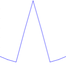

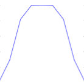

 (-372,-12)<span>(a)</span>
(-216,-12)<span>(b)</span> (-60,-12)<span>(c)</span> [sec3fig1]

The shearlet filters are then computed in the Fourier domain to allow
application of the convolution theorem. This approach only requires
array multiplications of the corresponding generating filters instead of
costly convolutions, followed by scaling in form of upsampling and
digital shearing. Those operations are implemented in TensorFlow,
enabling to use accelerating hardware such as GPUs to significantly
reduce the running time.

In our API, the function that generates the shearlet system is named .
It requires the following parameters:

-   : The expected horizontal size of the system.

-   : The expected vertical size of the system.

-   : The maximum number of scales.

-   : The generating 2D fan directional filter.

-   : The generating 1D low pass filter.

The output of this function will be a tensor with the shearlet filters,
an 1D array with the root mean square of each filter, and an array with
the set of corresponding scaling and shearing indexes.

### The Tensor Shearlet Decomposition and Reconstruction

After generating the shearlet filters, we can compute the digital
shearlet transform of any image $I\in \mathbb{R}^{N\times M}$. Assuming
$J\in \mathbb{N}_0$ scales, the digital shearlet system is given by
$$DS(N,M,J) = \{ \text{shearletFilters}[i] \in \mathbb{R}^{N\times M}\text{ for } i\in \{1,\ldots,nShearlets(J)\}\},$$
where $N,M$ are the size in each dimension and $nShearlets(J)$ the
number of possible shearlet filters (redundancy) for the maximum sclae
$J$, given by . The shearlet coefficients will then be computed in
Fourier domain as already mentioned in Subsection [subsec:fft]. This
leads to the following shearlet decomposition algorithm, where refers to
the complex conjugate:

[H]

**Input:** A digital image $f\in \mathbb{R}^{N\times M}$, a digital
shearlet system .\

**Output:** Coefficients $\in \mathbb{R}^{N,M,nShearlets}$\
 [sec3alg1]

Using the TensorFlow functions , , , and , the tensor shearlet
decomposition can then be computed as follows, where is an image tensor
of shape and is the tensor of shearlet filters of shape :

``` {.python language="Python"}
def tfsheardec2D(xtf, tfshearlets):
    xfreqtf = tfftshift(tf.fft2d(itfftshift(xtf)))

    return tfftshift(tf.transpose(tf.ifft2d(tf.transpose(itfftshift(
        tf.multiply(tf.expand_dims(xfreqtf,3),tf.conj(tfshearlets))),
        0,3,1,2])),[0,2,3,1]))
```

The shearlet reconstruction, which maps the shearlet coefficients to an
image, can be derived similarly by using the dual filters as in and the
associated digital dual shearlet system
$$DualDS(N,M,J) = \{ \text{dualFilters}[i] \in \mathbb{R}^{N\times M}\text{ for } i\in \{1,\ldots,nShearlets(J)\}\},$$
as follows:

[H]

**Input:** A set of digital shearlet coefficients
$\in \mathbb{R}^{N,M,nShearlets}$, a dual digital shearlet system .\

**Output:** The reconstructed image $f_{rec}\in \mathbb{R}^{N\times M}$\
// Reconstruction initialization\
$f_{rec} := 0 \in \mathbb{R}^{N\times M}$\

$f_{rec}$:= fftshift(ifft(ifftshift($f_{rec}$)))

[sec3alg1\*]

We now describe our TensorFlow implementation of Algorithm [sec3alg1\*]
in its tensor form, which uses the explicit form of the dual filters
from ). For this, we let be the tensor shearlet coefficients of shape ,
the tensor digital shearlet filters of shape , and the weights to
compute the dual filters from the shearlet filters. The following script
is our TensorFlow implementation of Algorithm [sec3alg2] in its tensor
form:

``` {.python language="Python"}
def tfshearrec2D(coeffstf, tfshearlets,tfdualFrameWeights ):
    Xfreqtf = tf.reduce_sum(tf.multiply(tfftshift(tf.transpose(
    tf.fft2d(tf.transpose(itfftshift(coeffstf),[0,3,1,2])),[0,2,3,1])),
    tfshearlets),axis=3)

    return tfftshift(tf.ifft2d(itfftshift(tf.multiply(Xfreqtf,
                                1/tfdualFrameWeights))))
```

Since this implementation is directly mapped from the Julia API which is
based on the faithful formulation of , it inherits the theoretical
properties of the continuous compactly supported shearlet transform, and
even gains significantly in terms of performance improvement and
heterogeneity as we will discuss in the next section.

Numerical Results {#sec:numerics}
=================

To test our tensor-based digitalization, we will provide numerical
experiments in four different problem settings. More precisely, we will
analyze the performance on shearlet decomposition and reconstruction as
well as on shearlet-based denoising and inpainting. To also show the
potential use of our library with respect to deep learning models for
inverse problems, we trained the learned primal-dual algorithm
@adler2018learned for low-dose computed tomography reconstruction on the
shearelet coefficients as part of our benchmarks. In order to take
advantage of TensorFlow’s heterogeneity, we ran our experiments on a
graphic card with 16 GB of graphic memory. That this was possible
without significant change of the original code gives testament to the
expressive power of TensorFlow’s computational graphs.

Tensor Shearlet Decomposition and Reconstruction
------------------------------------------------

We start with tensor shearlet decomposition and reconstruction. For
this, the first step is to compute the corresponding shearlet system.
The function is the constructor of a tensor digital shearlet system with
filters of shape with maximum number of scales given by and generated
with the scaling filter and directional fan filter . Using API , the
construction can be performed by the following Python commands:

``` {.python language="Python"}
# Import the library
import tfshearlab

# Define the parameters
N = 128
M = 128
scalingFilter = 'Shearlab.filt_gen("scaling_shearlet")'
directionalFilter = 'Shearlab.filt_gen("directional_shearlet")'

# Compute the system
tfshearletsystem = tfshearlab.getshearletsystem2D(N,M,nScales,
                   directionalFilter,scalingFilter)
```

This will create a computational graph with the operations required to
generate the system. To obtain the values, the graph then needs to be
evaluated by

``` {.python language="Python"}
import tensorflow as tf
tfshearletsystem_values = tf.Session.run(tfshearletsystem)
```

This computed system can be applied to images of size . To illustrate
the form of the generated filters, we refer to Figures [sec4fig1]. The
construction of this system takes approximately 5.80 seconds, in
comparison with the construction of the system in the Julia API, which
requires 20.17 seconds. This already shows a 3.5x time improvement. As
reasons for this improvement both the use of the GPU and the
broadcasting functionality of TensorFlow that optimally vectorize the
application of functions can be identified. The main bottleneck is the
application of the digital shearing operator which is not optimally
implemented in GPU, requiring upsampling and indexing.

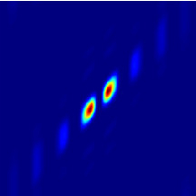

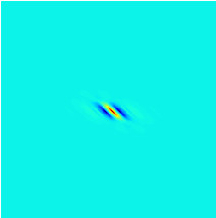\
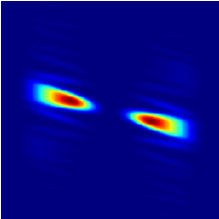

 (-216,123)<span>(a)</span>
(-60,123)<span>(b)</span> (-216,-12)<span>(c)</span>
(-60,-12)<span>(d)</span> [sec4fig1]

Having the shearlet filters available, we can now compute the shearlet
decomposition and reconstruction. As an example image we use the
standard flower image depicted in Figure [sec4fig3].

 [sec4fig3]

After having imported the image in Figure [sec4fig3] into the python
environment using the library by

``` {.python language="Python"}
from scipy import ndimage as img
x = img.imread("path-to-image")
```

we compute the tensor coefficients of the image with the function and
evaluate the computational graph by performing

``` {.python language="Python"}
# Convert he image array to tf.Tensor
xtf = tf.constant(x.reshape([1,x.shape[0], x.shape[1]]), dtype= tf.complex64)
# Compute the coefficients
coeffstf = tfshearlab.tfsheardec2D(xtf, tfshearletsystem)
# Evaluate the graph
coeffs = tf.Session.run(coeffstf)
```

This operation requires approximately 0.031 seconds. Comparing this with
the 1.18 seconds of the standard CPU-based Julia API shows a 30$times$
performance improvement. Figure [sec4fig4] shows examples of some of the
derived shearlet coefficients.


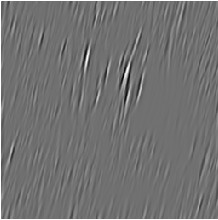 (-216,-12)<span>(a)</span>
(-60,-12)<span>(b)</span> [sec4fig4]

The shearlet reconstruction can now be performed in a similar manner as
the decomposition by using the function and running the corresponding
computational graph:

``` {.python language="Python"}
# Run the reconstruction
xtfrec = tfshearlab.tfshearrec2D(coeffstf, tfshearletsystem)
# Evaluate the graph
xrec = tf.Session.run(xtfrec)
```

The running time is 0.033 seconds, whereas the standard CPU-based Julia
API requires 1.00 seconds, again showing a 30$\times$ of performance
improvement. We remark that – as already discussed before – those
improvements were expected due to the use of acceleration hardware, such
as GPU. In a future we anticipate an even greater improvement with the
use of tensor processing units (TPU), which however are so far solely
available in the cloud.

Shearlet Denoising
------------------

The optimal sparse approximation properties of shearlets make them a
perfect candidate for sparse regularization of inverse problems, see,
for instance, @genzel2014inpainting. In this and the next subsection, we
will discuss two of such inverse problems, namely denoising and
inpainting.

For denoising, we follow the general approach suggested by Labate et al.
@labate2012denoising, which aims to recover the original image from its
noisy version, where we assume Gaussian white noise. The recovery
algorithm is based on hard thresholding the shearlet coefficients of the
noisy image. For this, assume that, instead of the original image
$f\in \ell^2(\mathbb{Z}^2)$, we only have access to its noisy version,
namely $$f_{noisy} (i,j) = f(i,j) + e(i,j),$$ where
$e(i,j)\backsim \mathcal{N}(0, \sigma^2)$. We then compute
$$f_{denoised} = SH^{-1} \mathcal{T}_{\delta} SH f_{noisy},$$ where $SH$
denotes the digital shearlet transform and $\mathcal{T}_{\delta}$ the
hard thresholding operator given by $$(\mathcal{T}_{\delta} x)(n) :=
\begin{cases}
x(n) & \text{if } |x(n)|\geq \delta, \\
0 & \text{else.}
\end{cases}$$ To increase the performance, we will use a different
thresholds $\delta_j$ on each scale $j$, chosen as
$$\delta_j = K_j \sigma.$$ In the case of four scales, we typically
choose $K = [K_j]_j = [2.5, 2.5, 2.5, 3.8]$. The quality of the
reconstruction will be measured using the peak signal-to-noise ration
(PSNR), given by
$$PSNR = 20 \log_{10}\frac{255\sqrt{N}}{||f-f_{denoised}||_F},$$ where
$N$ is the number of pixels and $||\cdot||_F$ denotes the Frobenius
norm.

In , denosing is then implemented as follows:

``` {.python language="Python"}
# Compute the shearlet coefficients of the noisy image
coeffstf_noisy = tfshearlab.tfsheardec2D(xtf_noisy, tfshearletsystem)

# Compute the thresholding weights with the RMS of the filters
weights = tf.constant(np.ones(coeffs.shape), dtype = tf.float32)

for j in range(len(tfshearletsystem.RMS)):
    weights[:,:,j] = tfshearletsystem.RMS[j]*tf.constant(np.ones((f.shape[0], f.shape[1])), dtype = tf.float32)

# Hard thresholding
coeffstf = coeffstf_noisy.copy()
zero_indices = tf.abs(coeffs) / (thresholdingFactor * weights * sigma) < 1
coeffstf_noisy[zero_indices] = 0

# Shearlet resconstruction
xtfrec = tfshearlab.tfshearrec2D(coeffstf, tfshearletsystem)

# Run the graph
xrec = tf.Session.run(xtfrec)
```

Again studying the running time, for an image of size , the algorithm
requires 1.05 seconds with a PSNR of 24.86 dB. For comparable results,
the standard CPU-based Julia API takes 1.00 seconds, indicating a
20$\times$ time performance improvement.

We would also like to compare with additional standard benchmarks,
namely, denosing by curvelets @candes2004curvelets via thresholding, and
the well known Block-matching and 3D filtering algorithm (BM3D)
@davob2007bm3d. We refer to the Table [table:Denoising-Results] for the
obtained PSNR and SSIM on these algorithms. Figure [sec4fig5] depicts
the visual results. In those experiments, we use additive white noise
with amplitude of 30. Being superior in running time, we notice that the
shearlet denoising approach also performs best concerning accuracy of
reconstruction.

[htb!]

<span>l c c c c</span> **Algorithm** & **PSNR** (dB) & **SSIM**\
Shearlets thresholding & 26.94 & 0.88\

Curvelets thresholding & 26.85 & 0.87\

BM3D & 25.15 & 0.85\

[table:Denoising-Results]


\
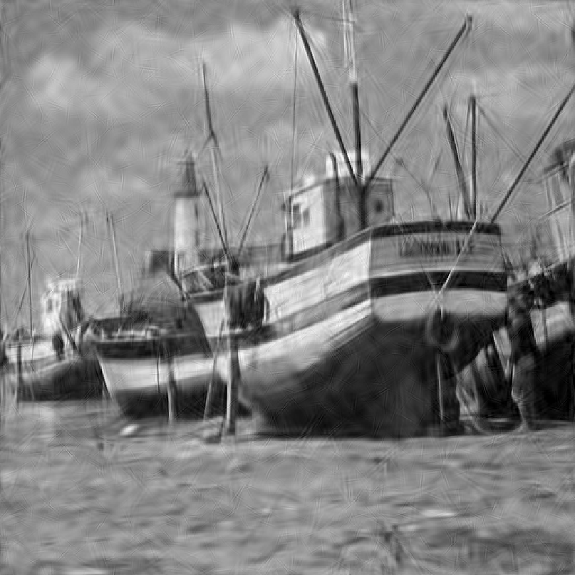


(-216,123)<span>(a)</span> (-60,123)<span>(b)</span>
(-216,-12)<span>(c)</span> (-60,-12)<span>(d)</span> [sec4fig5]

Shearlet Inpainting
-------------------

Inpainting refers to the problem of reconstructing missing parts of an
image. In the digital setting, the problem can be formulated as follows:
A grayscale image $f\in \ell^2(\mathbb{Z}^2)$ is partially occluded by a
binary mask $M\in \{0,1\}^{\mathbb{Z}\times\mathbb{Z}}$, i.e.,
$$f_{masked} (i,j) = f(i,j)M(i,j),$$ and we aim to reconstruct $f$.

The algorithm for inpainting the missing parts which we will employ is
based on an iterative hard thresholding scheme using the sparsifying
properties of the shearlet transform @genzel2014inpainting. In each step
a forward shearlet transform is performed on the unoccluded parts of the
image combined with the already inpainted features in the missing areas.
Then a hard thresholding is applied to the coefficients, followed by the
inverse shearlet transform. By gradually decreasing the thresholding
constant, this algorithm approximates a sparse set of coefficients whose
synthesis approximates the original image on the unoccluded parts. This
can be implemented in as follows:

[H]

**Input:** $f_{masked}, M, \delta_{init}, \delta_{min}, iterations$\

**Output:** $f_{inpainted}$\
$f_{inpainted} := 0;$\
$\delta := \delta_{init};$\
$\lambda := (\delta_{min})^{1/(iterations -1)}$\
 [sec3alg2]

For our experiments, we used an image of size and ran 50 iterations of
the iterative hard thresholding for both random and squared mask
patterns. The resulting two images showed a PSNR of 24.45 dB and 28.21
dB, respectively. In both cases, the running time was 15 seconds, which
is approximately 14$\times$ faster than the classical CPU Julia API.

Similar to denoising, we used the same inpainting algorithm but with
curvelets as the sparsifying system @candes2004curvelets as an
additional benchmark. We refer to Table [table:Inpainting-Results] for
the obtained PSNR and SSIM of these algorithms. Figures [sec4fig6]
and [sec4fig7] depict the obtained results for the two used masks. As
opposed to the running time, the accuracy of the recovered image is very
similar when using shearlets and curvelets. This is not unexpected due
to the similarities of both systems.

[htb!]

<span>l c c c c</span> **Algorithm** & **Mask** & **PSNR** (dB) &
**SSIM**\
Shearlets inpainting & Random & 28.75 & 0.90\
Curvelets inpaitning & Random & 28.60 & 0.90\

Shearlets inpainting & Squared & 32.21 & 0.92\

Curvelets inpaitning & Squared & 32.15 & 0.92\

BM3D & 25.15 & 0.85\

[table:Inpainting-Results]

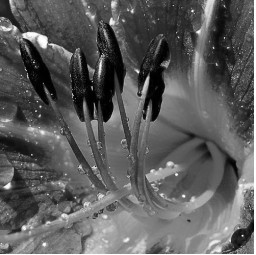

\


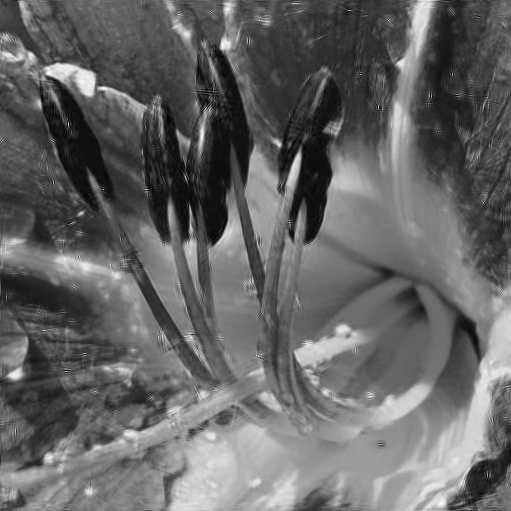
(-216,123)<span>(a)</span> (-60,123)<span>(b)</span>
(-216,-12)<span>(c)</span> (-60,-12)<span>(d)</span> [sec4fig6]


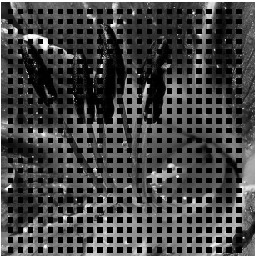\


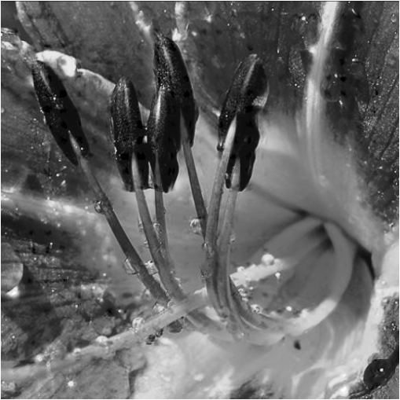
(-216,123)<span>(a)</span> (-60,123)<span>(b)</span>
(-216,-12)<span>(c)</span> (-60,-12)<span>(d)</span> [sec4fig7]

Learned primal-dual reconstruction on shearlet coefficients
-----------------------------------------------------------

Inverse problems aim to recover those parameters characterizing the
system from observed measurements. In mathematical terms, an inverse
problem can be formulated as follows: Given a forward operator
$\mathcal{T}:X\longrightarrow Y$, where $X$ and $Y$ are for now Hilbert
spaces, and letting $\delta g\in Y$ be a single sample of a $Y$-valued
random variable representing the noise of data $g \in Y$. Then the goal
is to recover the true data $f_{\text{true}}\in X$ from measurements
$g\in Y$, where $$g = \mathcal{T}(f_{\text{true}})+\delta g.$$

A large class of examples of inverse problems stems from medical imaging
applications such as computed tomography (CT). In CT, the forward
operator is the Radon transform. The measurement process strikes X-rays
through an object coming from a known source. The rays travel on a line
$L$ from the source through the object to a detector, being attenuated
by the material on the specific line. The precise definition makes this
procedure mathematically precise.

[Radon transform, @quinto2012introxray] Let $f\in L^1(\mathbb{R}^2)$,
$\varphi\in [0,\pi)$, and $s\in \mathbb{R}^2$. Moreover, the unit vector
in direction $\varphi$ denoted as $\theta$ and its orthogonal vector
$\theta^{\perp}$ are given by:
$$\theta = \theta(\varphi) := (\cos\varphi, \sin\varphi) \quad \theta^{\perp} = \theta^{\perp}(\varphi) := (-\sin\varphi, \cos\varphi).$$
The *Radon transform* of $f$ is then given by the line integral

$$\label{eq:RayTransform}
\mathcal{R}f(s, \varphi) := \int_{x\in L(\varphi, s)} f(x)dx = \int_{-\infty}^{\infty} f(s\theta(\varphi)+t\theta^{\perp}(\varphi))dt,$$

where the line $L(\varphi, s)$ is defined as
$$L(s, \varphi):= \{ x\in\mathbb{R}^2: x\cdot\theta(\varphi) = s\}.$$

In practical cases, often only a limited amount of locations and angles
$(s, \varphi)\in \mathbb{R}^2\times [0,\pi)$ can be measured, resulting
in highly ill-posed inverse problems. To tackle the problem of
reconstruction from CT measurements, Adler and Öktem proposed the
learned primal-dual reconstruction algorithm @adler2018learned. This
approach exploits neural networks by unrolling a (classical) proximal
primal-dual optimization method and using convolutional neural networks
instead of the proximal operators. Letting
$\mathcal{T}:X\longrightarrow Y$, the classical non-linear learned
primal-dual hybrid gradient algorithm (PDHG) also known as the
Chambolle-Pock algorithm, can be applied to minimization problems of the
form
$$\min_{f\in X} \left[\mathcal{F}(\mathcal{T}(f))+\mathcal{G}(f)\right],$$
where $\mathcal{F}:Y\longrightarrow\mathbb{R}$ and
$\mathcal{G}:X\longrightarrow \mathbb{R}$ are functionals on the
dual/primal spaces. This algorithm is inspired by the gradient descent
algorithm, simultaneously minimizing the primal problem and maximizing
the dual problem. In order to generalize the algorithm to also
non-smooth functions, in each step the iteration is computed using a
proximal operator defined by
$$\textbf{prox}_{\tau\mathcal{G}}(f) = \text{argmin}_{f'\in X}\left[\mathcal{G}(f')+\frac{1}{2\tau}||f'-f||_X^2\right].$$
The PDHG algorithm is made precise in the sequel. Notice that
$\mathcal{F}^*$ represents the Fenchel conjugate of $\mathcal{F}$,
$h\in Y$ is the dual variable, and
$\left[\partial\mathcal{T}(f_i)\right]^*:Y\longrightarrow X$ is the
adjoint of the derivative of $\mathcal{T}$ at the point $f_i$.

[H]

**Input:** $\mathcal{T}$ forward operator, $\sigma, \tau > 0$, s.t.
$\sigma\tau||\mathcal{T}||^2 < 1$, $\gamma \in [0,1]$, $f_0\in X$,
$h_0\in Y$ and iterations $I$\

**Output:** $f_{recon}$\
 [sec4alg1]

Following the recent trend on hybrid methods combining data-driven and
model-based methods, one can take advantage of the power of the
structure of the PDHG algorithm, while learning the best update in the
primal and dual problem, in some sense of approximating the proximal
with neural networks. This idea leads to the learned primal-dual
algorithm @adler2018learned. The approach itself in addition includes
minor modifications of the PDHG algorithm such as extending the primal
space to allow the algorithm some “memory” between iterations, i.e.,
$f = [f^{(1)}, f^{(2)}, ..., f^{(N_{\text{primal}})}]\in X^{N_{\text{primal}}}$,
similarly done in the dual space $Y$, obtaining $Y^{N_{\text{primal}}}$,
each $f^{(j)}$ and $Y^{(j)}$ represent an iteration of the step
algorithm. To improve the updating step, the network is also allowed to
learn how to combine the elements in the evaluation of the proximals.

[H]

**Input:** $\mathcal{T}$, $f_0\in X^{N_{\text{primal}}}$ and
$h_0\in Y^{N_{\text{dual}}}$ and iterations $I$\

**Output:** $f_{recon}$\
 **return** $f_I^{(1)}$ [sec4alg2]

In Algorithm [sec4alg2], the operators $\Gamma_{\theta_i^d}$ and
$\Lambda_{\theta_i^d}$ approximate the proximal primal and dual
operators, known as learned proximal operators, parameterized by
$\{\theta_i^d\}\subseteq \Theta$. In the implementation of the learned
primal-dual for CT reconstruction @adler2018learned, the learned
proximal operators are residual 3 layered convolutional neural networks
of the form
$$\text{Id}+\mathcal{W}_{w_3,b_3}\circ\mathcal{A}_{c_2}\circ\mathcal{W}_{w_2,b_2}\circ\mathcal{A}_{c_1}\circ\mathcal{W}_{w_1,b_1},$$
where $W_{w_j, b_j}$ are affine transform with weights
$w_j\in X^{n\times m}$ and biases $b_j\in \mathbb{R}^m$ with the $k-th$
component being given by
$$\left[ \mathcal{W}_{w_j, b_j}([f^{(1)}, ..., f^{(n)})\right]^{(k)} = b_j^{(k)}+\sum_{l=1}^n w_j^{(l,k)}\ast f^{(l)}.$$
Further, $A_{c_j}$ are non-linearities represented by the Parametric
Linear Units (PReLU) functions $$A_{c_j}(x) =
\begin{cases}
x & \text{if }x\geq 0, \\
-c_j x & \text{else}.
\end{cases}$$ In the original implementation, the parameters
$N_{\text{primal}}$ and $N_{\text{dual}}$ were set to $5$, the number of
iterations $I=10$, the convolutions were of $3\times 3$ pixel size, and
the number of channels for each primal learned proximal,
$6\rightarrow 32\rightarrow 32\rightarrow 5$, and for the duals
$7\rightarrow 32\rightarrow 32\rightarrow 5$. With this setting, the
total depth of the network is 60 convolutional layers.

As mentioned in Subsection [SecFeat] the layers in the convolutional
neural networks can be seen as feature maps. In the present situation,
we can imagine that these maps aim to to extract key features of the
image in the dual and primal space. Having in mind that the shearlet
transform is a powerful feature extractor for images, it seems
conceivable that performing the learned primal-dual reconstruction in
the shearlet coefficients improves its performance. To show that this is
indeed the case and providing further evidence of the applicability of
we provide the following three numerical experiments: (1) We trained the
learned primal-dual in the image domain, (2) we trained it in the
shearlet domain by using the classical ShearLab implementation, and (3)
we trained it in the shearlet domain using the Tensorflow
implementation. We used randomly generated ellipses as training set and
the Shepp-Loggan Phantom as test set. In the second and third case, we
took each shearlet slice as a channel in the network. This increased the
number of parameters of the network by the number of shearlet slices.
The implementation of the network was done in TensorFlow, while the ray
transform was made using the Python library ODL (Operator Discretization
Library) with the ASTRA toolbox as backend.

We computed the reconstruction for a full angle, low-dose ray transform,
where only 30 angles were measured. From the experiments, we observed
that the mean squared loss converged faster in terms of iterations when
training in the shearlet domain, mainly caused by the convenient
representation of the image singularities in the shearlet domain. When
the network is trained in the shearlet domain using the classical
ShearLab implementation, each iteration takes significantly longer than
when trained in the image domain. The main reason of this computational
bottleneck is the required streaming of the tensors between the network
computations done by Tensorflow in the GPU and the performance of the
shearlet transform and its dual done in the CPU. This bottleneck is
overcome when using , due to the reason that then the shearlet
coefficients are computed within Tensorflow, removing any need to stream
the tensors to the CPU. By using in combination with the learned
primal-dual algorithm, we attained similar performance in terms of
training and evaluation time with respect to the non-shearlet version,
and improved reconstruction performance.

Table [table:LPD-Results] shows that the learned primal-dual
reconstruction in the shearlet domain achieves better reconstruction
performance as compared to training on the image domain – with
performance measured in PSNR and SSIM – with similar time performance
when using , although significantly slower when using the classical
ShearLab implementation. In this table we also depict the performance
obtained when training the learned primal-dual approach on the 2D
Daubechies 2 (db2) @daubechies1992wavelets wavelet domain, which
presents a significant drop in quality in comparison with the other
approaches.

[htb!]

<span>l c c c c</span> **Model implementation** & **Training
iterations** & **Time per iteration** & **PSNR** & **SSIM**\
LPD Image Domain & 50,000 & 0.5 sec & 32.19 & 0.92\

LPD Wavelets (2D Daubechies 2) & 20,000 & 0.9 sec & 24.43 & 0.85\

LPD Shearlets (classic ) & 20,000 & 4.2 sec & 39.19 & 0.98\

LPD Shearlets () & 20,000 & 0.8 sec & 39.15 & 0.98\

[table:LPD-Results]

In Figure [fig:lpd-results], one can observe that the learned
primal-dual reconstruction on random ellipses achieves a better
reconstruction quality evaluated on the Shepp-Logan phantom when it is
trained in the shearlet domain, although the quality of both
reconstructions is comparable. We also notice that the training in the
wavelet domain performs poorly, mainly due to the limitations of
wavelets on representing anisotropic features @candes2004curvelets.


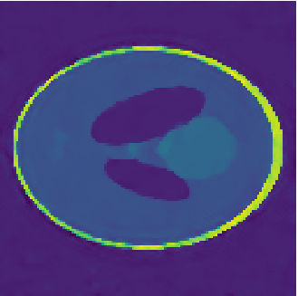\
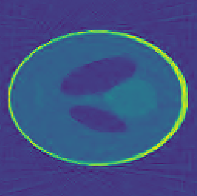

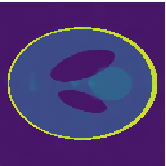
(-216,123)<span>(a)</span> (-60,123)<span>(b)</span>
(-216,-12)<span>(c)</span> (-60,-12)<span>(d)</span> [fig:lpd-results]

Conclusion {#sec:conclusion}
==========

We observe that the tensor formulation of the shearlet transform is of
low cost with the additional advantage of allowing the embedding in
different deep learning frameworks, in particular TensorFlow. This is of
particular interest for imaging science and computer vision due to the
powerful feature extraction and representation of 2D singularities
provided by the shearlet transform. In addition to the potential
benefits of utilizing the shearlet transform in preprocessing steps of
deep learning predictive models, having the shearlet transform at hand
in TensorFlow allows to use the heterogeneity and scalability provided
by the framework. This significantly improves the performance of the
shearlet system generation, decomposition, and reconstruction.

Focusing on the time performance, we observe that the running time of
the shearlet decompostion and reconstruction was improved by 30 times as
compared to the running time in the previous state-of-the-art
implementation, namely, the Julia API of . Similar improvements in
running time can also be witnessed in the generation of the system, as
well as in shearlet denoising and inpainting. The main reason for this
superior behavior is the possibility to deploy the algorithms in a
graphic card without any change of the underlying code. With the same
logic, this method can be deployed without cost on the current
state-of-the-art deep learning accelerating hardware, the tensor
processing units (TPU).

In addition to traditional applications of the shearlet transform, we
also discussed the application in hybrid algorithmic approaches. We
focused on tomographic reconstruction methods based on deep neural
networks, such as the learned primal-dual reconstruction. We showed that
allows to boost the evaluation of the shearlet transform within the
network layers. This enables us to take advantage of both the
representation power of the shearlet system and the heterogeneity and
performance of the tensorflow framework.

Concluding, the presented tensor version of the shearlet transform
provides a highly effective tool that will allow researchers and
practitioners to use the shearlet transform in various imaging
applications and deep learning models without the necessity of
interaction with external frameworks.

Acknowledgements {#acknowledgements .unnumbered}
================

H.A.-L. is supported by the Berlin Mathematical School. G.K.
acknowledges partial support by the Bundesministerium fur Bildung und
Forschung (BMBF) through the Berliner Zentrum for Machine Learning
(BZML), Project AP4, RTG DAEDALUS (RTG 2433), Projects P1 and P3, RTG
BIOQIC (RTG 2260), Projects P4 and P9, and by the Berlin Mathematics
Research Center MATH+, Projects EF1-1 and EF1-4.

References
=========

